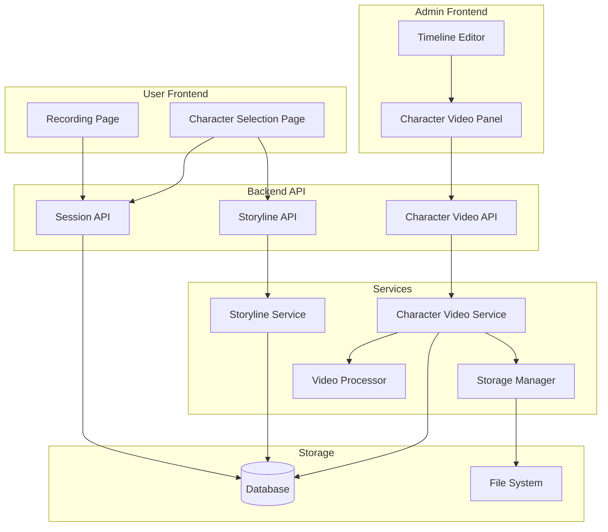

# Design Document: Character-Specific Videos

## Overview

本设计文档描述了"角色专属背景视频"功能的技术实现方案。该功能扩展现有的故事线系统，允许为每个动捕角色配置独立的背景视频。核心思路是在 `StorylineCharacterDB` 关联表中添加视频路径字段，并在前端角色选择流程中根据用户选择的角色获取对应的视频。

## Architecture



## Components and Interfaces

### 1. Database Model Extension

扩展 `StorylineCharacterDB` 表，添加视频相关字段：

```python
class StorylineCharacterDB(Base):
    """Extended model for storyline-character associations with video support."""
    __tablename__ = "storyline_characters"

    id: Mapped[int] = mapped_column(Integer, primary_key=True, autoincrement=True)
    storyline_id: Mapped[str] = mapped_column(String(36), ForeignKey("storylines.id", ondelete="CASCADE"))
    character_id: Mapped[str] = mapped_column(String(36), ForeignKey("characters.id", ondelete="CASCADE"))
    is_default: Mapped[bool] = mapped_column(Integer, default=False)
    display_order: Mapped[int] = mapped_column(Integer, default=0)
    
    # New fields for character-specific video
    video_path: Mapped[Optional[str]] = mapped_column(String(255), nullable=True)
    video_duration: Mapped[Optional[float]] = mapped_column(Float, nullable=True)
    video_thumbnail: Mapped[Optional[str]] = mapped_column(String(255), nullable=True)
    video_uploaded_at: Mapped[Optional[datetime]] = mapped_column(DateTime, nullable=True)
```

### 2. Character Video Service

新建 `CharacterVideoService` 处理角色视频的上传、验证和管理：

```python
class CharacterVideoService:
    """Service for managing character-specific videos."""
    
    async def upload_character_video(
        self,
        storyline_id: str,
        character_id: str,
        video_file: UploadFile
    ) -> CharacterVideoResponse:
        """Upload a character-specific video with validation."""
        pass
    
    async def validate_video_duration(
        self,
        video_duration: float,
        base_video_duration: float,
        tolerance: float = 1.0
    ) -> bool:
        """Validate video duration matches base video within tolerance."""
        pass
    
    async def get_character_video_path(
        self,
        storyline_id: str,
        character_id: str
    ) -> Optional[str]:
        """Get video path for a character, returns None if not set."""
        pass
    
    async def delete_character_video(
        self,
        storyline_id: str,
        character_id: str
    ) -> bool:
        """Delete character-specific video and update database."""
        pass
    
    async def get_video_status_for_storyline(
        self,
        storyline_id: str
    ) -> List[CharacterVideoStatus]:
        """Get video upload status for all characters in a storyline."""
        pass
```

### 3. API Endpoints

新增角色视频管理的 API 端点：

```python
# POST /api/admin/storylines/{storyline_id}/characters/{character_id}/video
# Upload character-specific video

# GET /api/admin/storylines/{storyline_id}/characters/{character_id}/video
# Get character video info

# DELETE /api/admin/storylines/{storyline_id}/characters/{character_id}/video
# Delete character-specific video

# GET /api/admin/storylines/{storyline_id}/character-videos
# Get all character video statuses for a storyline

# GET /api/storylines/{storyline_id}/video?character_id={character_id}
# Public API: Get video path for character (used by frontend)
```

### 4. Frontend Components

#### Admin Frontend - CharacterVideoPanel

```typescript
interface CharacterVideoStatus {
  characterId: string;
  characterName: string;
  characterThumbnail: string | null;
  hasVideo: boolean;
  videoPath: string | null;
  videoDuration: number | null;
  videoThumbnail: string | null;
  uploadedAt: string | null;
}

interface CharacterVideoPanelProps {
  storylineId: string;
  baseVideoDuration: number;
  characters: StorylineCharacter[];
  onVideoUploaded: () => void;
}
```

#### User Frontend - Character Selection Enhancement

修改 `CharacterSelectionPage` 组件，在选择角色后获取对应的视频路径：

```typescript
interface CharacterWithVideo {
  id: string;
  name: string;
  thumbnail: string | null;
  hasSpecificVideo: boolean;
}

// When user selects character, store video path in session
const handleCharacterSelect = async (characterId: string) => {
  const videoPath = await api.getCharacterVideoPath(storylineId, characterId);
  await api.createSession({
    storylineId,
    characterId,
    videoPath: videoPath || storyline.baseVideoPath
  });
};
```

## Data Models

### Pydantic Models

```python
class CharacterVideoUpload(BaseModel):
    """Schema for character video upload response."""
    video_path: str
    video_duration: float
    video_thumbnail: str
    message: str = "Video uploaded successfully"

class CharacterVideoStatus(BaseModel):
    """Schema for character video status."""
    character_id: str
    character_name: str
    character_thumbnail: Optional[str] = None
    has_video: bool = False
    video_path: Optional[str] = None
    video_duration: Optional[float] = None
    video_thumbnail: Optional[str] = None
    uploaded_at: Optional[datetime] = None

class CharacterVideoListResponse(BaseModel):
    """Schema for listing all character videos in a storyline."""
    storyline_id: str
    base_video_duration: float
    characters: List[CharacterVideoStatus]

class StorylineCharacterExtended(BaseModel):
    """Extended character info including video data."""
    character_id: str
    is_default: bool = False
    display_order: int = 0
    video_path: Optional[str] = None
    video_duration: Optional[float] = None
    video_thumbnail: Optional[str] = None
```

### Session Model Extension

扩展 Session 模型以存储选择的角色和视频路径：

```python
class SessionCreate(BaseModel):
    storyline_id: str
    character_id: str  # Selected character for motion capture
    video_path: str    # Resolved video path (character-specific or default)
```

## Correctness Properties

*A property is a characteristic or behavior that should hold true across all valid executions of a system-essentially, a formal statement about what the system should do. Properties serve as the bridge between human-readable specifications and machine-verifiable correctness guarantees.*

### Property 1: Video Duration Validation

*For any* character-specific video upload with duration D and base video duration B, the upload SHALL be accepted if and only if |D - B| ≤ 1.0 second.

**Validates: Requirements 1.2, 2.3**

### Property 2: Character Video Status Consistency

*For any* storyline with N assigned characters, querying video status SHALL return exactly N status entries, each correctly reflecting whether a video has been uploaded.

**Validates: Requirements 1.3**

### Property 3: Cascade Delete on Character Removal

*For any* storyline-character association with an uploaded video, removing the character from the storyline SHALL result in the video file being deleted from the file system.

**Validates: Requirements 1.4**

### Property 4: Video Path Resolution

*For any* character selection in a storyline, the resolved video path SHALL be the character-specific video path if it exists, otherwise the storyline's base video path.

**Validates: Requirements 3.2, 3.3**

### Property 5: Session Video Path Storage

*For any* session created with a character selection, the session SHALL store the correct video path (character-specific or default) that matches the video path resolution logic.

**Validates: Requirements 3.4**

### Property 6: Database Association Integrity

*For any* character-video association, the database record SHALL contain valid storyline_id, character_id, and video_path fields, where storyline_id and character_id reference existing records.

**Validates: Requirements 5.1, 5.2**

### Property 7: Storyline Cascade Delete

*For any* storyline deletion, all associated character-video records and their video files SHALL be deleted.

**Validates: Requirements 5.3**

### Property 8: Character Cascade Delete

*For any* character deletion, all video associations for that character across all storylines SHALL be removed.

**Validates: Requirements 5.4**

### Property 9: File Path Convention

*For any* uploaded character-specific video, the file SHALL be stored at the path `data/storylines/{storyline_id}/videos/{character_id}.mp4`.

**Validates: Requirements 6.1, 6.2**

### Property 10: Export-Import Round Trip

*For any* storyline with character-specific videos, exporting and then importing the storyline SHALL restore all character-video associations with identical video content.

**Validates: Requirements 6.3, 6.4**

## Error Handling

### Video Upload Errors

| Error Code | Condition | Response |
|------------|-----------|----------|
| 400 | Invalid video format (not MP4/H.264) | "Invalid video format. Only MP4 with H.264 codec is supported." |
| 400 | Video duration mismatch (>1s difference) | "Video duration ({duration}s) differs from base video ({base}s) by more than 1 second." |
| 404 | Storyline not found | "Storyline not found." |
| 404 | Character not assigned to storyline | "Character is not assigned to this storyline." |
| 413 | Video file too large | "Video file exceeds maximum size limit." |
| 500 | Video processing failed | "Failed to process video: {error}" |

### Query Errors

| Error Code | Condition | Response |
|------------|-----------|----------|
| 404 | Character video not found | Returns null (not an error, fallback to base video) |
| 404 | Storyline not found | "Storyline not found." |

## Testing Strategy

### Property-Based Testing

使用 Hypothesis 库进行属性测试，验证核心正确性属性：

1. **Duration Validation Property Test**
   - 生成随机视频时长和基础视频时长
   - 验证验证逻辑正确接受/拒绝基于1秒容差

2. **Video Path Resolution Property Test**
   - 生成随机故事线配置（有/无角色专属视频）
   - 验证路径解析逻辑返回正确路径

3. **Cascade Delete Property Test**
   - 创建随机故事线-角色-视频关联
   - 验证删除操作正确级联

4. **File Path Convention Property Test**
   - 生成随机 storyline_id 和 character_id
   - 验证生成的文件路径符合约定格式

### Unit Tests

1. **CharacterVideoService Tests**
   - 测试视频上传流程
   - 测试视频删除流程
   - 测试状态查询

2. **API Endpoint Tests**
   - 测试各端点的请求/响应
   - 测试错误处理

3. **Database Model Tests**
   - 测试关联创建/更新/删除
   - 测试级联删除行为

### Integration Tests

1. **End-to-End Upload Flow**
   - 上传视频 → 验证存储 → 查询状态

2. **Frontend Integration**
   - 角色选择 → 视频路径解析 → Session 创建

